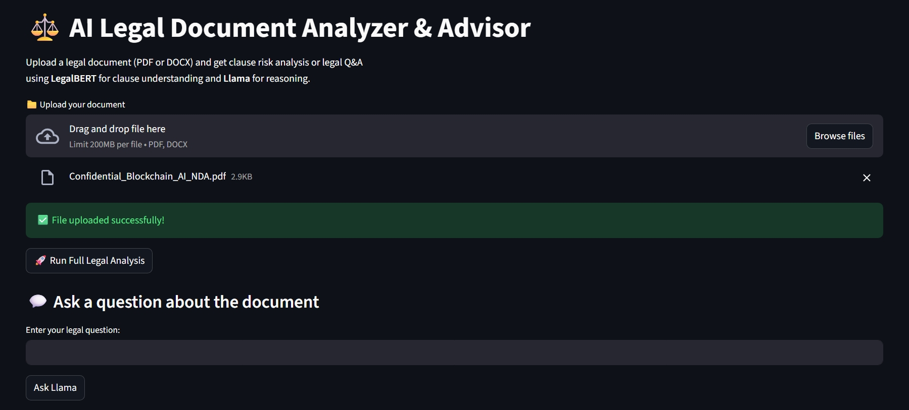
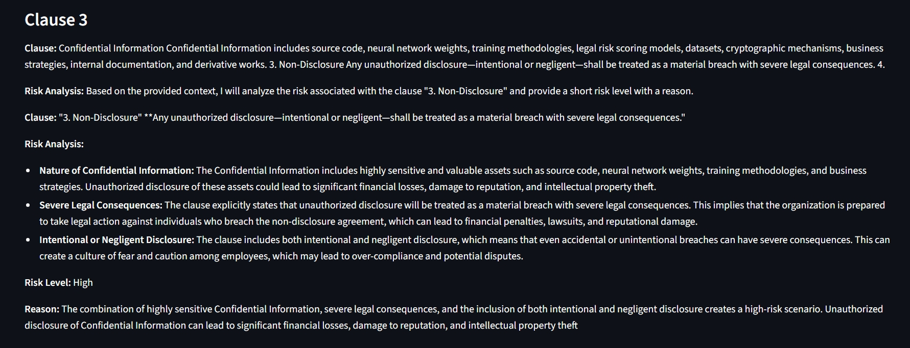
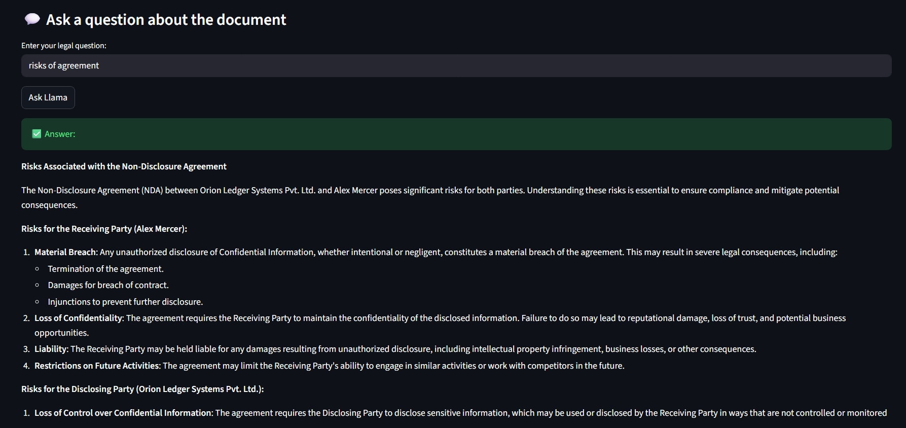

# AI Legal Document Analyzer ⚖️

## Overview
This project is an AI-powered system designed to analyze complex legal documents and make them understandable for non-legal users.

## Problem Statement
Legal documents are often lengthy, complex, and difficult for the general public to interpret, leading to misinterpretation and legal risk.

## Solution
The system uses:
- **LegalBERT** for clause-level risk identification
- **LLaMA** (via Hugging Face Inference API) for contextual legal explanations
- **Streamlit** for a simple and interactive user interface

## Features
- Upload legal documents (PDF/DOCX)
- Clause-wise risk analysis
- Natural language legal Q&A
- Lightweight deployment using cloud-based LLaMA

## Screenshots

### 📤 Document Upload
Upload your legal document (PDF/DOCX) easily and securely.

### ⚠️ Clause Risk Analysis
Automated clause-level risk detection with LegalBERT and contextual explanation via LLaMA.

- Example 1:

- Example 2:

### 💬 Legal Q&A
Ask questions about your document in natural language and get concise answers.

## Tech Stack
- Python
- LegalBERT
- LLaMA (Hugging Face)
- Streamlit
- Transformers
- FAISS for semantic search of clauses

## How to Run
1. Clone the repo: `git clone <your-repo-link>`
2. Create a virtual environment: `python -m venv venv`
3. Activate environment:
   - Windows: `venv\Scripts\activate`
   - Mac/Linux: `source venv/bin/activate`
4. Install dependencies: `pip install -r requirements.txt`
5. Run the app: `streamlit run app.py`

## How It Works
1. User uploads a legal document (PDF/DOCX).
2. **LegalBERT** extracts and classifies clauses for potential legal risks.
3. **LLaMA** provides detailed, human-readable explanations for each clause.
4. Users can also ask natural language questions about the document, which the system answers contextually.

## Q&A Feature
- Ask specific legal questions about your uploaded document.
- Get clear, concise answers from the AI using both LegalBERT and LLaMA models.

## Disclaimer
This tool is for educational purposes only and does not provide legal advice.

## License
This project is licensed under the **MIT License**. See the [LICENSE](LICENSE) file for details.
